# 📝 Zidio Task Management System

A full-stack task management system designed for teams to collaborate, assign tasks, track progress, and analyze productivity efficiently.

---

## 🚀 Features

- 👥 User Roles: Admin, Manager, Employee
- ✅ Task Creation & Assignment
- 📅 Calendar View for Deadlines
- 📊 Analytics Dashboard
- 🔔 Notifications System
- 🧑‍💻 User Authentication (Login / Register)
- 🎨 Fully Responsive UI using Tailwind CSS
- 🔐 Role-based Route Protection

---

## 🖥️ Tech Stack

### Frontend
- React.js
- React Router
- Tailwind CSS
- Redux Toolkit
- React Icons

### Backend
- Node.js and Express
- MongoDB
- JWT Authentication
- REST API

---

## 🔧 Setup Instructions

### 📁 Clone the Repository

```bash
git clone https://github.com/your-username/zidio-task-management.git
cd zidio-task-management
```

### 📦 Install Dependencies

```bash
go to each folder cd zidio-frontend and cd zidio-backend
and install this

npm install
```

### ▶️ Run the App

```bash
npm start
```

## 📸 Screenshots

### 🏠 Home Page
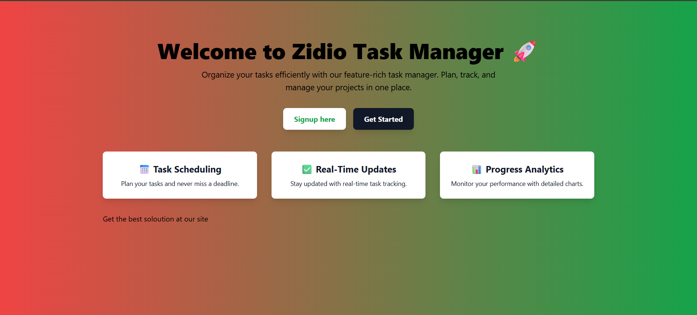
### Login page
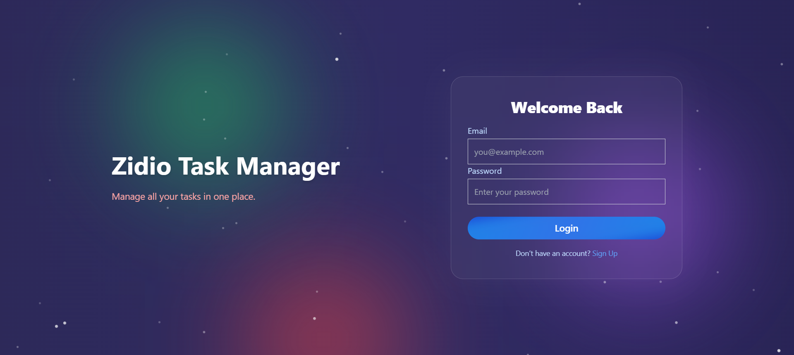
### Sign up page
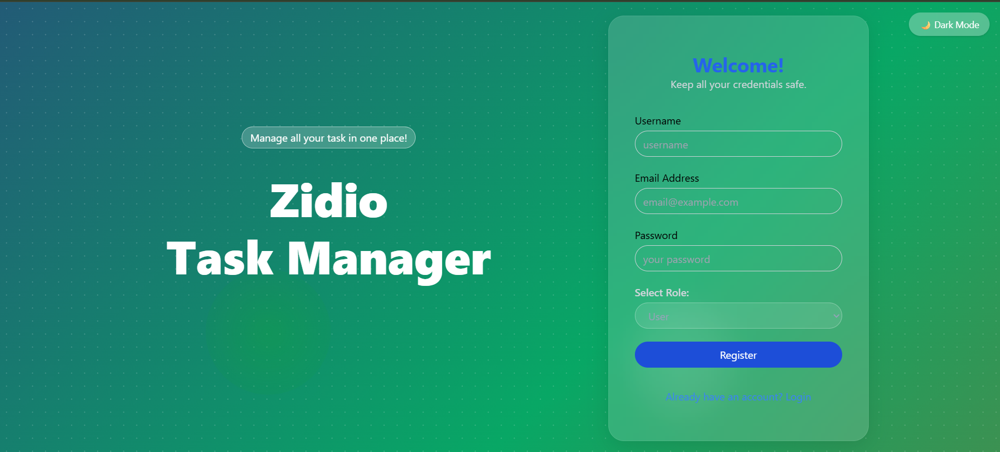
### Employee Dash Board
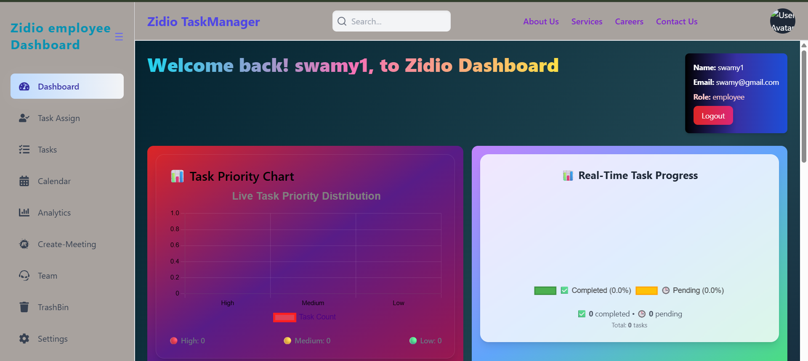
### Manager Dash Board
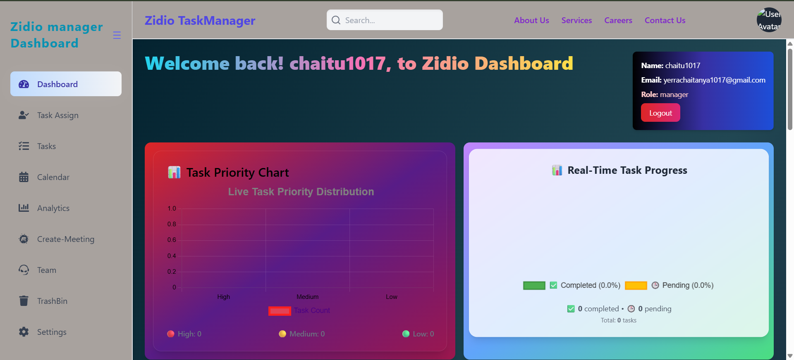
### Manager Task 
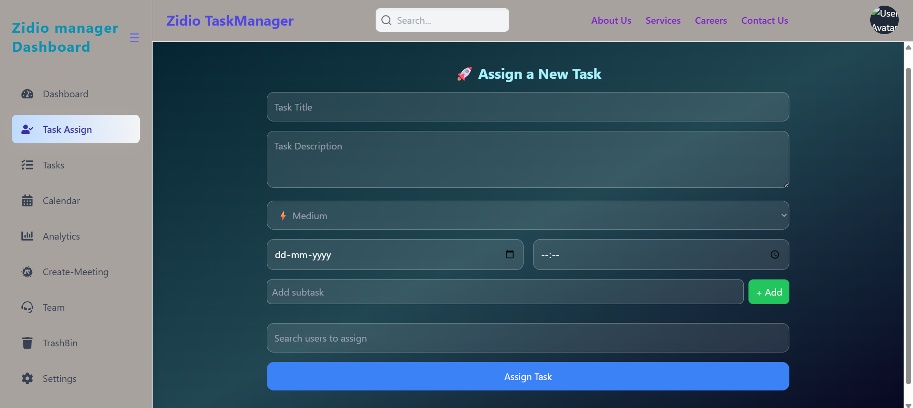
### Manager Task Assigining
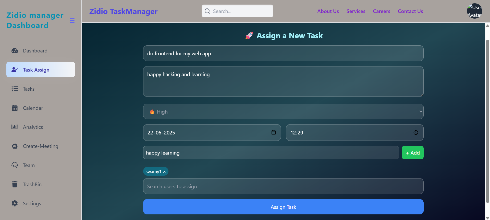
### Task Successful assign
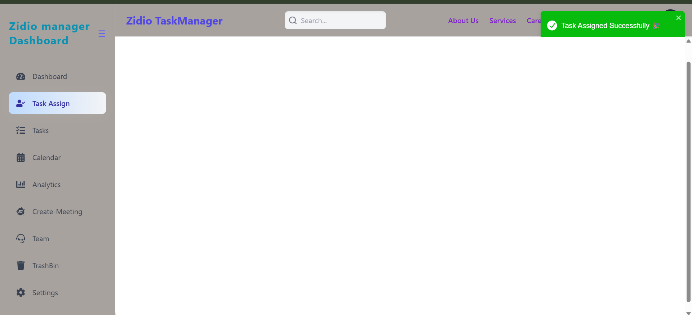
### Meeting page
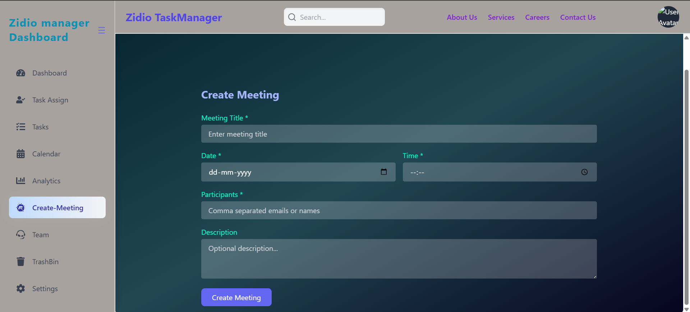
### Task Page
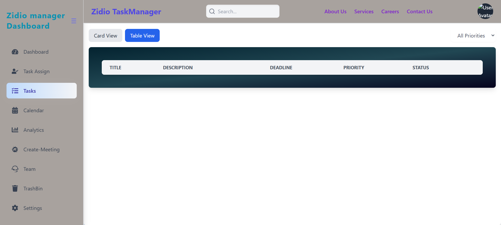
### Calendar View
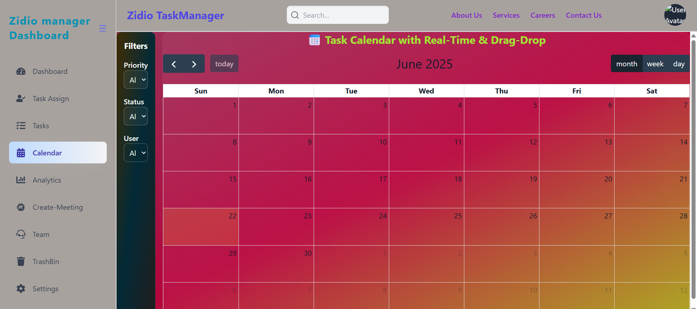
### About us
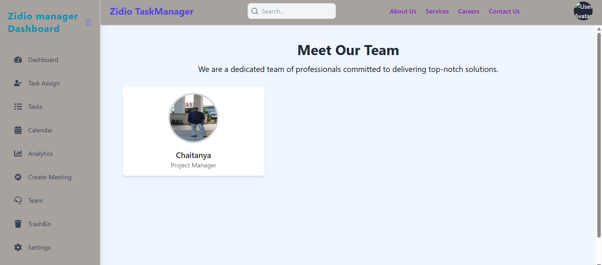
### services
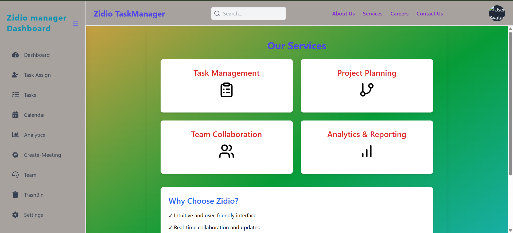
### Career Page
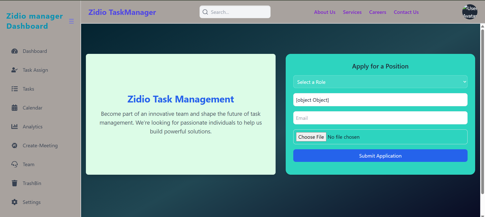
### Get in touch page
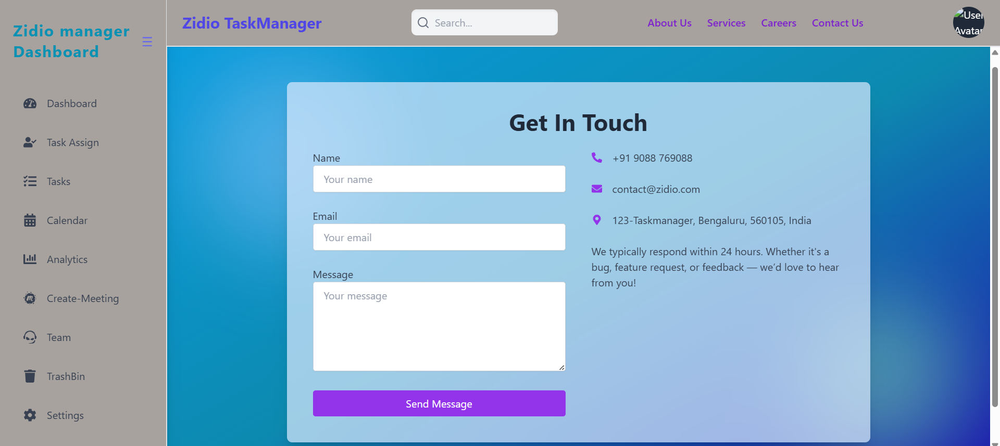
### Task Analysis Page
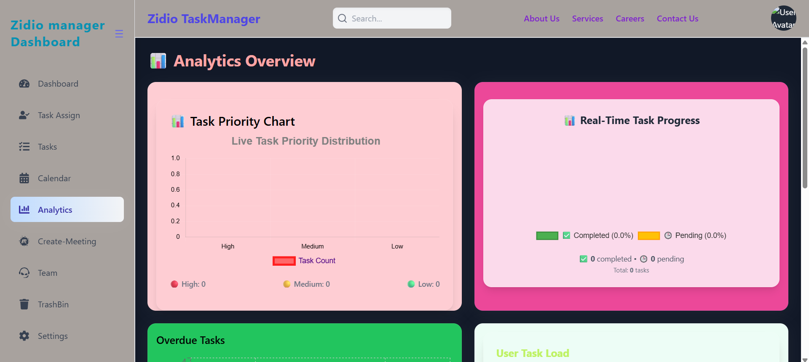
